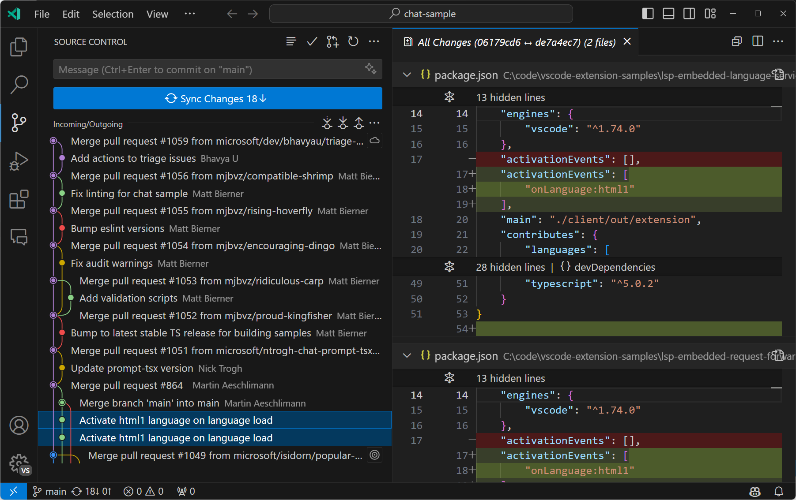

# Syncing Files with Git and GitHub

The code for this class is hosted on GitHub. As I discussed, this code will change from time-to-time. To keep your local copy of the code up-to-date, you will need to sync your local copy with the code on GitHub. In our last
lecture, we discussed how we can clone the repo from GitHub and why this is advantageous over simply downloading
the code manually. Now, we'll take advantage of our having cloned with Git by pulling the latest changes from the
GitHub repo.

## An overview of Git in VS Code

Let's now review the major Git concepts, as outlined here: https://code.visualstudio.com/docs/sourcecontrol/overview

## GitKraken

Now, let's orient ourselves with GitKraken. It will often be easier to view changes in GitKraken than in VS Code, but that's a preference. 

## Pulling Changes from GitHub

Now, let's pause and sync the changes from GitHub. Follow these directions to do so: https://docs.github.com/en/desktop/working-with-your-remote-repository-on-github-or-github-enterprise/syncing-your-branch-in-github-desktop

This might look something like this on VS Code:




```{note}
Pause here and make sure everyone is able to sync code from GitHub.
```
